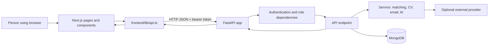

# Wazifny Project Guide

This guide explains the code that is currently in this repository: what the product does, how the frontend and backend communicate, where the main features live, and how data moves through the system. It is an orientation guide, not a claim that every feature is production-ready.

## 1. What the application is

Wazifny is a job marketplace with three account roles:

- **Talent** users maintain a profile, add skills and experience, upload a CV, search and save jobs, receive match recommendations, apply, message employers, and view learning suggestions.
- **Employer** users maintain a company profile, create and manage job postings, review applicants, save candidates, message applicants, and view a subscription plan.
- **Admin** users can view platform information, search and block accounts, and moderate job status.

The browser application is built with Next.js 14, React, TypeScript, and Tailwind CSS. The API is built with FastAPI and Python. MongoDB stores application data. AI and email providers are optional integrations configured through environment variables.

## 2. How a request travels through the system

The frontend owns presentation and user interactions. `frontend/lib/api.ts` defines the API base URL, request/error handling, TypeScript response types, and functions for API operations. Backend endpoints validate input with Pydantic schemas, use dependencies for authentication/role checks, then query MongoDB or call a service. Response schemas shape what is returned.

The API prefix defaults to `/api/v1`; for local development the frontend API base defaults to `http://localhost:8000/api/v1`. The backend also exposes `/health` outside that prefix.

## 3. Repository map

### Frontend: `frontend/`

- `app/`: Next.js App Router pages and root styling/layout.
- `app/(auth)/`: login, registration, forgotten-password, and reset-password pages. Parentheses group routes in the filesystem; they do not appear in the URL.
- `app/(talent)/` and `app/talent/`: talent dashboard features. Some pages are under route groups, others under the direct `talent` path.
- `app/(employer)/` and `app/employer/`: employer dashboard features.
- `app/(admin)/`: admin overview, user, blocked-user, and job-moderation pages.
- `app/jobs/`: public job search and job detail pages.
- `components/`: reusable landing, auth, job, talent, employer, and admin UI.
- `lib/api.ts`: API client, shared TypeScript types, and feature API functions.
- `lib/landing-data.ts`: static landing-page fallback data.
- `store/authStore.ts`: Zustand session state and browser persistence.
- `hooks/useRequireAuth.ts`: client-side helper for pages that need a signed-in user.
- `next.config.js`, `tailwind.config.ts`, and `postcss.config.js`: frontend build and styling configuration.

### Backend: `backend/app/`

- `main.py`: constructs the FastAPI app, configures CORS, attaches routers, connects to MongoDB on startup, and closes the client on shutdown.
- `core/config.py`: reads settings from environment variables and `.env`.
- `core/security.py`: password hashing/verification and JWT creation/decoding.
- `db/mongodb.py`: shared asynchronous MongoDB client and database access.
- `api/v1/router.py`: attaches feature routers under `/api/v1`.
- `api/v1/endpoints/`: HTTP routes and application-level orchestration.
- `schemas/`: Pydantic input and output models.
- `models/`: Mongo document shape helpers/defaults.
- `services/`: reusable authentication, matching, CV parsing, AI, translation, and notification logic.
- `ai/`: text extraction, embeddings, and similarity utilities used by feature services.
- `utils/deps.py`: current-user, role, and pagination dependencies.
- `scripts/`: database/AI diagnostics and demo-data seeding.
- `tests/`: currently includes a basic health endpoint test.

### Project materials: `docs/`

The folder contains the business requirements document, an entity relationship diagram, the project proposal, and this code guide. The diagrams and proposal explain intent; the Python and TypeScript files define current behavior.

## 4. Frontend routes and user journeys

The page files under `frontend/app` map to browser URLs. The most important routes include:

| Area | Browser routes / pages | Main purpose |
|---|---|---|
| Public | `/`, `/about`, `/jobs`, `/jobs/[id]`, `/courses` | Landing page, product information, job discovery, job details, course catalog |
| Authentication | `/login`, `/register`, `/forgot-password`, `/reset-password` | Sign in/up and password recovery |
| Talent | `/dashboard`, `/talent/jobs`, `/talent/matches`, `/talent/profile`, `/talent/applications`, `/talent/saved`, `/talent/courses`, `/talent/messages`, `/talent/notifications` | Profile, matching, applications, learning, and communication |
| Employer | `/employer/dashboard`, `/employer/post-job`, `/employer/manage-jobs`, `/employer/applicants`, `/employer/company-profile`, `/employer/saved-candidates`, `/employer/subscription`, `/employer/messages`, `/employer/notifications` | Hiring workflow and company management |
| Admin | `/overview`, `/users`, `/blocked-users`, `/jobs-moderation` | Platform overview and moderation |

The route groups in parentheses are Next.js organizational groups. For example, a page stored in `app/(auth)/login/page.tsx` appears at `/login`.

### Login and session state

The login page calls `login()` in `lib/api.ts`, which sends credentials to `POST /auth/login`. The API verifies the password and returns a bearer token and account role. The frontend stores these values in the Zustand store and browser storage, then navigates according to role.

Protected page helpers and role-specific layouts improve navigation and user experience. The backend remains the authority: protected endpoints use `get_current_user` and `require_role` in `backend/app/utils/deps.py`.

## 5. Backend API areas

All paths below are relative to `/api/v1` unless stated otherwise. This is a feature map; inspect the endpoint modules for request fields, response shapes, and exact rules.

| Router prefix | Main operations |
|---|---|
| `/auth` | Register, login, inspect current account, request password reset, set a new password |
| `/public` | Landing statistics, categories, testimonials, articles, and combined landing data |
| `/translations` | Translate a batch of text into the requested supported language |
| `/talents` | Get/update the signed-in talent profile, preferences, skills, education, experience, saved jobs, and CV upload |
| `/employers` | Company profile, dashboard, saved candidates, and subscription plan state |
| `/jobs` | Search/list jobs, recommendations, employer job management, job detail, and saving jobs |
| `/applications` | Apply, list the talent's applications, view applicants, update application status, access applicant CV, request AI screening |
| `/matches` | Talent's AI-assisted job matches |
| `/courses` | Course catalog and talent skill-gap analysis |
| `/messages` | Conversations, messages, applicant conversations, and suggested replies |
| `/notifications` | List notifications and mark one or all as read |
| `/admin` | Overview, user search/blocking, and job moderation |

Public job search may accept an optional bearer token so responses can include the signed-in talent's application state. Talent-specific recommendations and profile routes require a talent role. Job creation and employer dashboards require an employer role. Admin operations require an admin role. Conversation routes additionally check that the signed-in account participates in the conversation.

## 6. Important feature flows

### Create an account and sign in

1. The frontend sends registration data to `POST /auth/register` or credentials to `POST /auth/login`.
2. The auth endpoint checks for an existing account and hashes new passwords using bcrypt through Passlib.
3. A JWT is created with the account ID as its subject, the role, and an expiry.
4. Protected API calls send the token in the `Authorization: Bearer ...` header.
5. `get_current_user` decodes the token and loads the current user from MongoDB; `require_role` rejects roles that are not allowed.

Password reset uses reset records and the notification service. Email delivery depends on provider configuration and is best-effort, so a successful API response should not automatically be interpreted as proof that an email was delivered.

### Search, matches, and recommendations

`services/matching_service.py` is the shared matching implementation. It gathers active job documents, optionally asks the configured AI provider to rank or score them, and validates returned job IDs against the real candidate set. It has non-AI fallback ranking so provider failure does not fabricate postings or necessarily leave the page empty. Talent scores can be saved in `job_matches` and reused by the matches/recommendations and related views.

AI output is advisory and probabilistic. A displayed score/reason is a ranking aid, not a guarantee of suitability or an employment decision.

### CV upload and profile autofill

The talent endpoint accepts CV uploads. `services/cv_parser_service.py` extracts text from PDF or DOCX, limits the text sent for extraction, and asks the AI service to return structured fields. The endpoint normalizes data and merges it into the profile while tracking AI-sourced fields so manually edited information can be preserved. If AI extraction is unavailable, the upload path can still leave profile completion to the user. The file is stored with the profile data in MongoDB; treat both the file and extracted text as sensitive personal information.

### Job application and employer review

The talent applies through `/applications`. The API checks the job and application method, creates the application, and triggers relevant in-app/email notifications. Employers fetch applicants for their own jobs and may update application statuses. The optional AI-screen endpoint compares a candidate and job and returns an advisory result; the hiring decision and status update remain separate actions.

### Messages and notifications

Messages are stored in MongoDB conversations and message records. The API checks participants before listing or sending conversation messages. Suggested replies are generated from conversation context when an AI provider is available; they are drafts for the user to review. Notifications are stored and can be marked read. The UI currently refreshes message data by polling rather than relying on a WebSocket connection.

### AI and translation providers

`services/ai_service.py` centralizes calls to configured language-model providers and JSON response parsing. Other services own the prompt and validate/normalize outputs. The translation service can fall back to a small manual translation mapping. Provider names, models, and credentials come from environment settings; provider calls can send relevant user-provided text outside the application, so review data handling before enabling them for real user data.

## 7. MongoDB data concepts

The application uses MongoDB collections rather than a relational database. Collection access in the code includes:

| Collection | What it represents |
|---|---|
| `users` | Account identity, role, password hash, and account state |
| `talent_profiles`, `talent_skills`, `educations`, `experiences`, `work_preferences` | Talent profile and search/matching inputs |
| `employer_profiles`, `employer_subscriptions` | Company information and plan state |
| `jobs` | Job posting content, ownership, and status |
| `applications`, `saved_jobs`, `saved_candidates`, `job_matches` | Applications, bookmarks, and match scores |
| `conversations`, `messages` | Participant conversations and their messages |
| `notifications`, `password_resets` | In-app notices and password recovery state |
| `courses`, `articles`, `testimonials` | Learning catalog and public landing/about content |

MongoDB ObjectIds are commonly converted to strings in API responses. Pydantic schemas in `backend/app/schemas/` define the public request/response contracts; raw documents should not be assumed to be identical to API output.

## 8. Configuration and local development

Start from the safe templates `backend/.env.example` and `frontend/.env.local.example`. The backend reads settings in `core/config.py`; the frontend reads `NEXT_PUBLIC_API_BASE_URL` in `lib/api.ts`. Replace placeholders in local ignored files only. `NEXT_PUBLIC_` values are embedded for browser use and must never contain private credentials.

Typical local workflow:

1. Create and activate a Python virtual environment inside `backend`.
2. Install `backend/requirements.txt`.
3. Copy the backend example file to `backend/.env`, fill local database and JWT settings, and optionally configure integrations.
4. Run `uvicorn app.main:app --reload` from `backend`.
5. Install frontend dependencies with `npm install` inside `frontend`.
6. Copy the frontend environment example to the expected local env filename and set the local API URL.
7. Run `npm run dev` from `frontend`.

The API health route is `/health`. FastAPI's interactive docs are available in development under `/docs` unless disabled by deployment configuration.

## 9. Demo data and sensitive values in source

`backend/scripts/seed.py` creates sample accounts and platform records for a demo database. The script currently contains hard-coded demo account credentials in source. The README and this guide do not repeat them. Treat seeded accounts as public demo credentials: run the script only against a disposable, isolated development database; never run it against production; and do not reuse seeded accounts or passwords for real services. Before sharing or deploying the repository, remove or replace those credentials and review the complete Git history if they were previously committed.

More generally, `.env.example` is a template and is expected to contain placeholders. A real `.env`, API key, database URI, CV, log, or production export must not be committed.

## 10. Security model and areas to understand

- **API authorization:** endpoint dependencies enforce login and role checks. Ownership checks still matter within a role, such as ensuring an employer can only change its own job or view its applicants.
- **Browser token storage:** `authStore.ts` stores the bearer token in `localStorage` and also writes a JavaScript-readable cookie. This is convenient for the current client-rendered flow, but any successful same-origin script injection can access the token. The cookie is not `HttpOnly`; browser role state is also user-editable and must not be trusted for authorization. For a production threat model, consider a backend-for-frontend with `HttpOnly`, `Secure`, `SameSite` cookies and CSRF protections.
- **CORS:** `main.py` uses configured origins and allows credentials. Production configuration should list only trusted frontend origins.
- **Passwords and tokens:** passwords are hashed; JWT signing depends on `JWT_SECRET_KEY`. Set a unique, high-entropy secret and rotate it if exposed.
- **Uploads and personal data:** enforce size/type limits, protect file access with ownership checks, avoid logging contents, and establish retention/deletion policies. Check actual production storage and backup access controls.
- **AI services:** CV text, job/profile content, or messages may be sent to configured providers by a feature. Review provider terms and minimize personal data before enabling this with real users.
- **Email:** the notification service sends reset and product emails through configured service credentials. Treat the provider key as secret and use a verified sender domain.
- **Operational controls:** the code should be paired with HTTPS, secret management, database access restrictions, backups, rate limits, monitoring, dependency maintenance, and deployment-specific debug/docs settings.

These points describe the code and practical areas to review; they are not a certification that the deployed system is secure.

## 11. Testing and current limitations

The visible automated test suite is small and includes a health endpoint check. Do not infer that all role permissions, ownership cases, file handling, provider failures, or user journeys are covered. Frontend package scripts provide lint/build commands; backend dependencies include FastAPI's test client. Add focused tests when changing a feature, especially authorization and data ownership.

The repository includes an employer subscription UI and API state changes, but no payment processor integration is evident in the current project code. Messaging currently uses polling. AI output depends on external provider configuration and has fallback behavior. The frontend and backend should be checked together after API schema changes because `frontend/lib/api.ts` mirrors backend response shapes.

## 12. Where to start when changing something

For a new or changed user feature, trace it in this order:

1. Find its page under `frontend/app/` and reusable UI under `frontend/components/`.
2. Find the API function and shared TypeScript interface in `frontend/lib/api.ts`.
3. Find the router registration in `backend/app/api/v1/router.py` and its endpoint module.
4. Check the request/response schemas in `backend/app/schemas/`.
5. Follow calls into `backend/app/services/` and the relevant MongoDB collections.
6. Confirm authentication, role, ownership, and data-validation behavior at the endpoint.
7. Update the frontend and backend contract together, then run the relevant lint/build/test checks.

## Main files worth opening first

1. `frontend/lib/api.ts` — frontend/backend contract and API calls.
2. `frontend/store/authStore.ts` — current browser session behavior.
3. `backend/app/main.py` — API app setup and lifecycle.
4. `backend/app/api/v1/router.py` — API feature map.
5. `backend/app/utils/deps.py` — authentication and role enforcement.
6. `backend/app/core/config.py` — configuration names and defaults.
7. `backend/app/services/matching_service.py` — search and match scoring.
8. `backend/app/api/v1/endpoints/talents.py` and `backend/app/services/cv_parser_service.py` — profile/CV flow.
9. `backend/scripts/seed.py` — demo data; read its credential warning above before using it.
